# Simple Agentic Workflow

> An **AI-driven, self-healing test-automation factory** for Java SOAP services.
> Three Claude agents detect bugs in production, fix the code, ship the patch, and close the ticket, without a human in the loop.

---

## demo recordings

* QA Tester agent: 
* Software Developer agent: 

## The pitch in one sentence

A faulty SOAP operation is detected against its written spec, a Jira bug is filed, a developer agent clones the repo, edits the Java source with `Math.*Exact` safe arithmetic, pushes to `main`, GitHub Actions deploys the fat JAR to a DigitalOcean droplet behind Nginx + Let's Encrypt, and a release agent verifies the deployment and closes the ticket, end to end, on its own.

---

## Runtime architecture


---

## The bug lifecycle, end to end

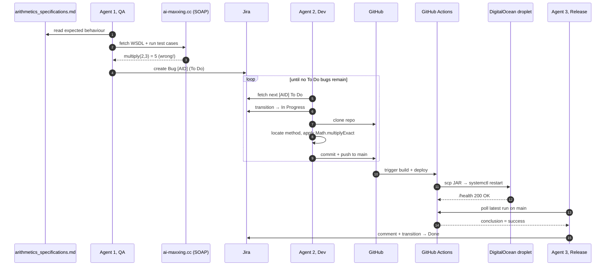

---

## Jira workflow, the agents' shared memory

The three agents never talk to each other directly. They coordinate via **Jira issue status**, which acts as a durable blackboard.

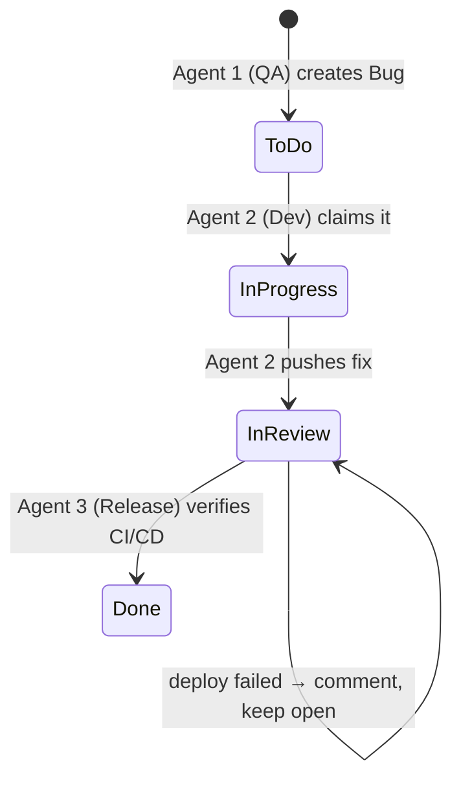

Every issue carries the `[AID]` prefix in its summary, a soft access control enforced in agent code so the shared `SSI` project stays uncontaminated by other use cases.

---

## Repositories in this org

| # | Repo | Role | Stack |
|---|------|------|-------|
| 0 | [`0_orchestration`](../../0_orchestration) | Sequencing the full pipeline (`qa → dev-loop → CI/CD poll → release`) | Python 3.11 |
| 1 | [`01_soap_arithmetics`](../../01_soap_arithmetics) | The target service under test, Java SOAP arithmetic with intentional bugs | Java 21, Jakarta XML WS 4.0, Maven, Ansible |
| 2 | [`02_agent1_qa`](../../02_agent1_qa) | QA Engineer, WSDL introspection + dynamic SOAP testing + Jira reporting | Python, Zeep, Anthropic SDK |
| 3 | [`03_agent2_dev`](../../03_agent2_dev) | Software Developer, clones repo, locates the bug, patches the Java, pushes | Python, GitPython, Anthropic SDK |
| 4 | [`04_agent3_release`](../../04_agent3_release) | Release Engineer, verifies the GitHub Actions run, closes the ticket | Python, GitHub REST API, Anthropic SDK |

---

## What each agent can do (tool surface)

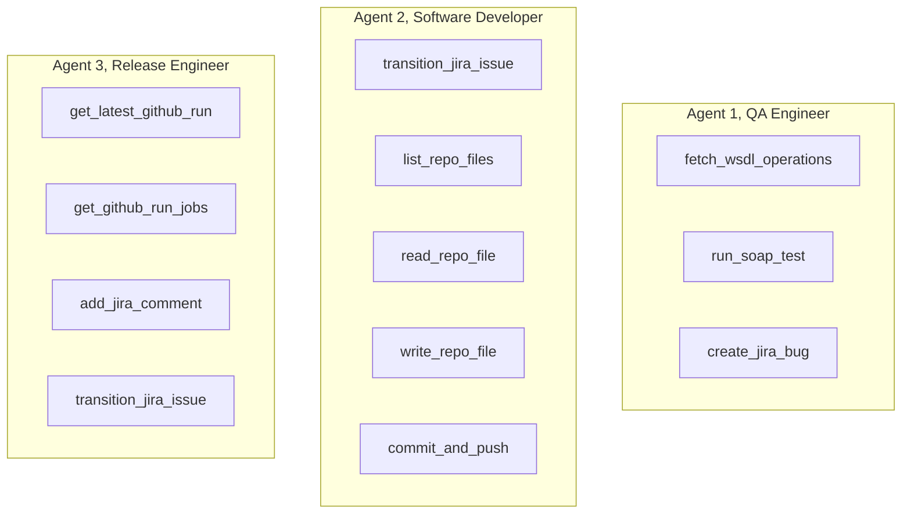

Each agent runs a standard Claude tool-use loop (`claude-opus-4-6`), the LLM picks tools, the Python harness executes them, results are fed back until the model emits `end_turn`.

---

## The intentional defects (demo scenarios)

The deployed service ships with three planted bugs so the agents always have something to find:

| Operation | Bug | Symptom | Expected fix |
|---|---|---|---|
| `subtract(a, b)` | Computes `a - 2b` | `subtract(10, 3) → 4` | `Math.subtractExact(a, b)` |
| `multiply(a, b)` | Uses `Math.addExact` | `multiply(2, 3) → 5` | `Math.multiplyExact(a, b)` |
| `divide(a, b)` | No zero-check | `divide(1, 0) → raw exception` | guard `if (b == 0)` + SOAP Fault |

---

## CI/CD pipeline

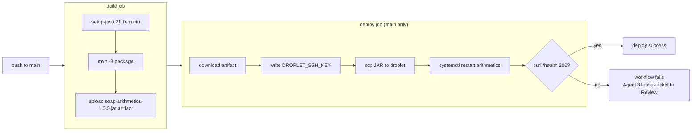

---

## Infrastructure stack

| Layer | Technology | Notes |
|---|---|---|
| **Reasoning** | Claude Opus (Anthropic API) | Tool-use loop per agent, system prompt cached |
| **Ticketing** | Jira Cloud REST API v3 | Project `SSI`, all AID issues prefixed `[AID]` |
| **VCS** | GitHub + dedicated machine account | Push via SSH from Agent 2 |
| **CI** | GitHub Actions | `build` (every push/PR) + `deploy` (main only) |
| **Runtime** | OpenJDK 21 + Jakarta XML WS 4.0 | Fat JAR, `Math.*Exact` for overflow-safe arithmetic |
| **Hosting** | DigitalOcean droplet (Ubuntu) | systemd unit `arithmetics` on `:8081` |
| **Edge** | Nginx + Let's Encrypt (Certbot) | TLS on `:443`, auto-renewing via systemd timer |
| **Provisioning** | Ansible (`ansible/bootstrap.yml`) | Two-phase Nginx config to bootstrap the cert |
| **Domain** | `ai-maxxing.cc` | A record → droplet IP |

---

## Security posture (MVP-honest)

- **Ticket scoping**, every Jira create / read / update is gated on the `[AID]` prefix, enforced in agent code. Cross-contamination with non-AID tickets in the shared `SSI` project is rejected at the tool call.
- **Credential scoping**, each agent gets only what it needs: QA has Jira write + WSDL read, Dev has GitHub push via a dedicated machine account's SSH key, Release has read-only Jira + read-only GitHub Actions PAT.
- **Audit trail**, every action is recorded in Jira (issue history + comments) and GitHub (commit log + Actions runs). Nothing is lost.
- **MVP caveats**, no human-in-the-loop, no automatic loopback if a fix regresses, single-pass logic. Documented intentionally.

---

## Running the full pipeline

```bash
# one shot, all four stages
python 0_orchestration/orchestrator.py

# or just one stage, for debugging
python 0_orchestration/orchestrator.py --agent qa
python 0_orchestration/orchestrator.py --agent dev
python 0_orchestration/orchestrator.py --agent release
```

Each agent reads its own `.env` (see `<agent>/.env.example`) and requires `ANTHROPIC_API_KEY`. The orchestrator chains them and polls GitHub Actions between Stage 2 and Stage 4.

---

## Why this matters

Classical test automation is brittle: a renamed field, a tweaked operator, a missing exception type, and the whole script breaks. This factory replaces that brittleness with **agentic flexibility**: each agent reads natural-language specs, introspects live contracts, reasons over real code, and uses the same enterprise tools (Jira, Git, CI) a human team would. The result is a closed remediation loop where the only artifact a human ever needs to read is the final, auto-closed Jira ticket.

# Agentic Systems — Primitives, Composition, and Classification

A schema for reasoning about LLM-based systems. Distilled from Anthropic's *Building Effective Agents* and extended to handle composite systems (workflow-of-agents, agent-of-workflows, etc.).

---

## 1. The three primitives

There are three building blocks. One is atomic; two are compositional.

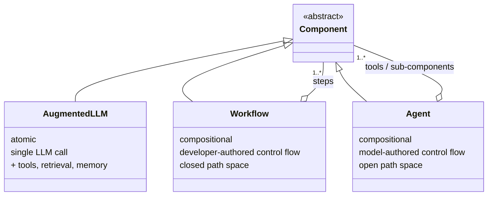

Composition is recursive: any `Workflow` or `Agent` can contain other `Component`s, including further workflows and agents. Only `AugmentedLLM` is atomic. Every leaf of the composition tree is ultimately an augmented LLM call.

---

## 2. Internal shape of each primitive

### 2.1 Augmented LLM (atom)

A single inference call enhanced with capabilities the model itself can invoke.

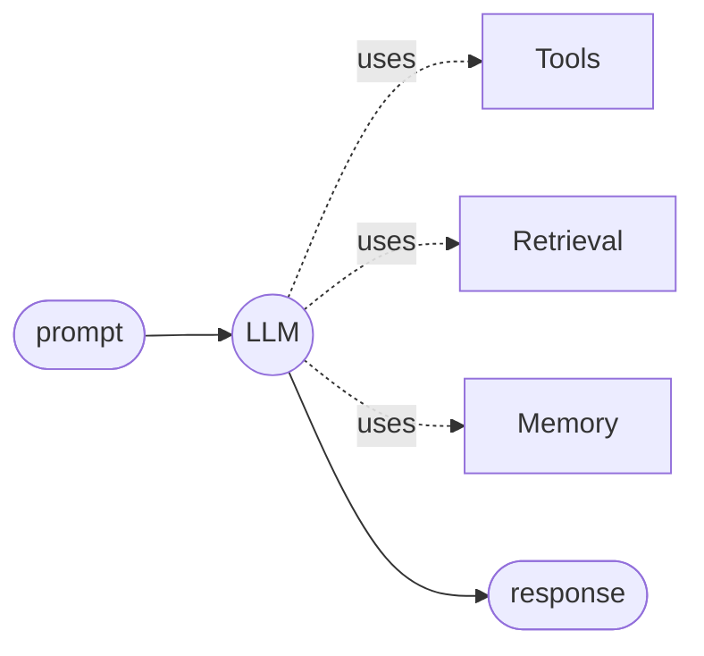

### 2.2 Workflow — developer-authored control flow

The path through the system is encoded in code. Branches are allowed but enumerable. The full execution graph can be drawn before runtime.

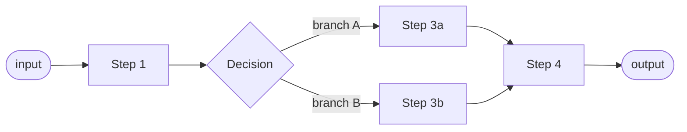

### 2.3 Agent — model-authored control flow

The LLM chooses what to do next at every step. The execution graph is generated at runtime and is not enumerable in advance.

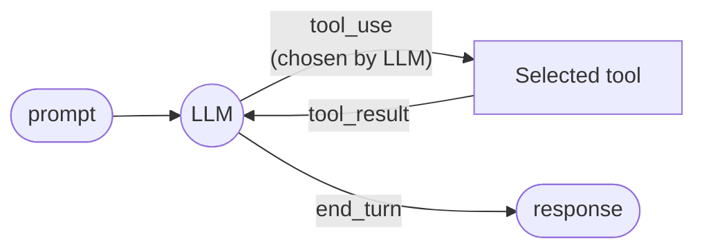

---

## 3. The six composition shapes

Classification applies independently at each node. Once a node is classified as Workflow or Agent, its composition shape depends on what kind of children it contains. Six pure shapes appear in practice (real systems often mix them):

| Composition                  | Macro        | Workers           | Typical use case                                      | Concrete example                                                |
|------------------------------|--------------|-------------------|-------------------------------------------------------|-----------------------------------------------------------------|
| Workflow of augmented LLMs   | Workflow     | Atomic LLM / tool calls | Simple closed tasks decomposed into fixed steps  | The five workflows in *Building Effective Agents*: prompt chaining, routing, parallelization, orchestrator-workers, evaluator-optimizer |
| Workflow of workflows        | Workflow     | Workflows         | Multi-stage deterministic pipelines                   | ETL where each stage is itself a fixed multi-step procedure     |
| **Workflow of agents**       | **Workflow** | **Agents**        | **Closed macro process with flexible sub-tasks**      | **CI/CD agent pipeline (your simple-agent-factory)**            |
| **Agent with tools**         | **Agent**    | **Atomic ops**    | **Open-ended task, single model orchestrating**       | **Claude.ai chat, Claude Code, most production agents**         |
| Agent of workflows           | Agent        | Workflows         | Open-ended task whose sub-procedures are fixed        | Agent whose `run_test_suite` tool is internally a fixed workflow |
| Agent of agents              | Agent        | Agents            | Open-ended task with open-ended delegated sub-tasks   | Dynamic multi-agent research with orchestrator + researchers + critics |

Two notes:

The "Atomic ops" category covers both augmented LLM calls and deterministic tool calls (`read_file`, `query_osv`, `run_python`). From the parent's perspective they are indistinguishable — both are non-composite, single-step operations.

In practice, children are often **mixed**: a workflow might have one step that is an augmented LLM call, another that is an agent, another that is a sub-workflow. The six shapes above are pedagogical reference points; real systems usually compose heterogeneously. The classification then applies per child.

Composition is recursive without depth limit. An agent-of-agents can contain agents-of-workflows, and so on. Classification at each node remains independent.

---

## 4. Worked examples

### 4.1 Workflow of agents

A fixed macro pipeline (workflow) whose stages are agents.

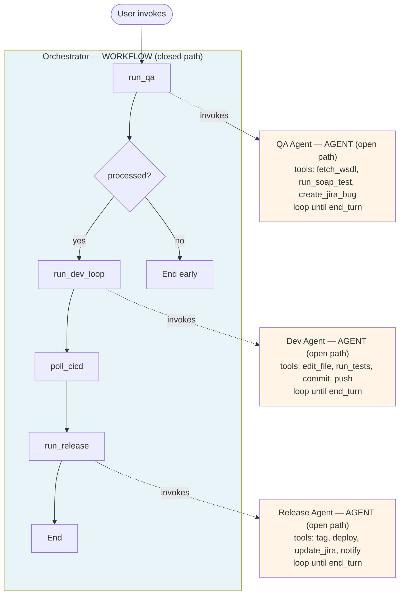

Reading this:

- **Macro layer is a workflow.** The four-stage pipeline is hardcoded in `orchestrator.py`. Every execution trace is enumerable before runtime.
- **Each worker is an agent.** The LLM inside chooses tools and stopping point on its own. Path space is open inside each box.
- **The composite is an *agentic workflow*** — a workflow whose components happen to be agentic.

### 4.2 Agent with tools

The most common production shape: a single agent orchestrating atomic tools, with a human-in-the-loop checkpoint between turns. This is what Claude.ai chat, Claude Code, and most chat-style agents are.

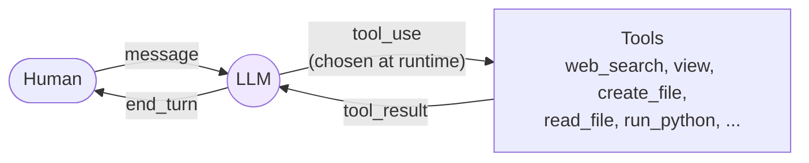

Reading this:

- **Single agent at the top level.** The LLM owns the control flow within each turn. No workflow wraps it.
- **Tools are atomic.** Deterministic functions or single LLM calls. No sub-agents, no sub-workflows.
- **Human-in-the-loop is orthogonal to the shape.** The human checkpoint between turns is not a workflow step; it is the point where the agent yields control and waits for new input. The agent could equally well run unattended (e.g. a scripted Claude Code invocation) without changing its classification.
- This is the bottom-right of the §5 diagram, and where most production agents live.

---

## 5. Classification rule

For any node in the composition tree, walk the diagram top-down. Q1 distinguishes atomic from compositional nodes. Q2 splits compositional nodes into workflow vs agent based on who owns the control flow. Q3 looks at the node's immediate children to identify the composition shape.

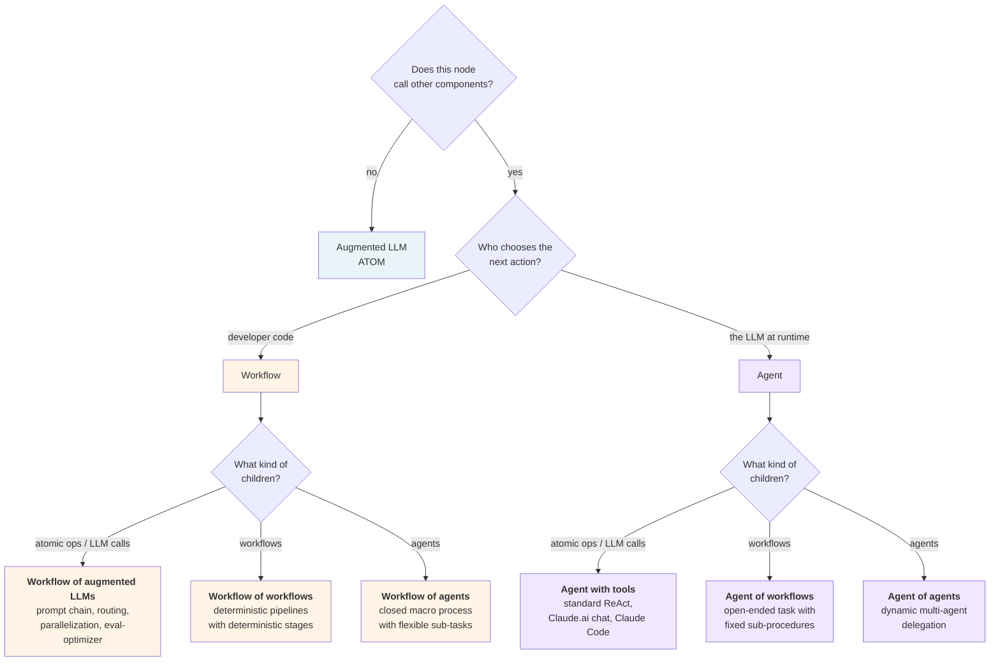

Apply the rule at each level — first to the root, then recursively to each child. Classification at any node is independent of its parent's or children's classifications. When children are mixed (some atomic, some agents, some workflows), apply Q3 per child rather than seeking a single label for the parent.

---

## 6. Design implications

Properties that follow from the schema and matter when designing real systems:

- **Auditability composes.** Workflow nodes are auditable by static enumeration of paths. Agent nodes are auditable behaviorally (evals, traces, monitoring). A workflow-of-agents inherits both properties at their respective layers.
- **Failure handling layers naturally.** A workflow can wrap retries, timeouts, and circuit-breakers around its agent workers. The agent does not need to be reliable on its own — the workflow's scaffolding makes the composite reliable.
- **Security is best enforced at workflow boundaries.** Each agent worker receives only the credentials and tools its scope requires. An agent cannot exceed boundaries it never had access to.
- **"Climb only as high as needed" applies at every level.** The right altitude often varies between layers. The macro pipeline can be a workflow even when individual stages need agentic flexibility, and vice versa.
- **The right shape is usually workflow-of-agents.** Pure agent-of-agents (the popular "multi-agent system" framing) sacrifices too much macro predictability for most production work. Pure workflow-of-augmented-LLMs sacrifices too much flexibility for non-trivial tasks. The mixed shape is where most well-engineered real systems land.

---

## 7. Vocabulary

- **Augmented LLM** — single LLM call with tools, retrieval, and/or memory. Atomic.
- **Workflow** — composition with developer-authored control flow. Closed path space.
- **Agent** — composition with model-authored control flow. Open path space.
- **Agentic component** — generic term for either a workflow or an agent (anything composing augmented LLMs).
- **Agentic workflow** — a workflow whose components are agents. The most common production shape.
- **Agentic system** — informal umbrella term; prefer one of the precise terms above.

---

## References

- *Building Effective Agents* (Anthropic, Dec 2024): https://www.anthropic.com/engineering/building-effective-agents
