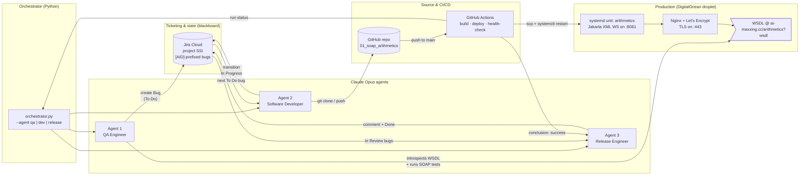
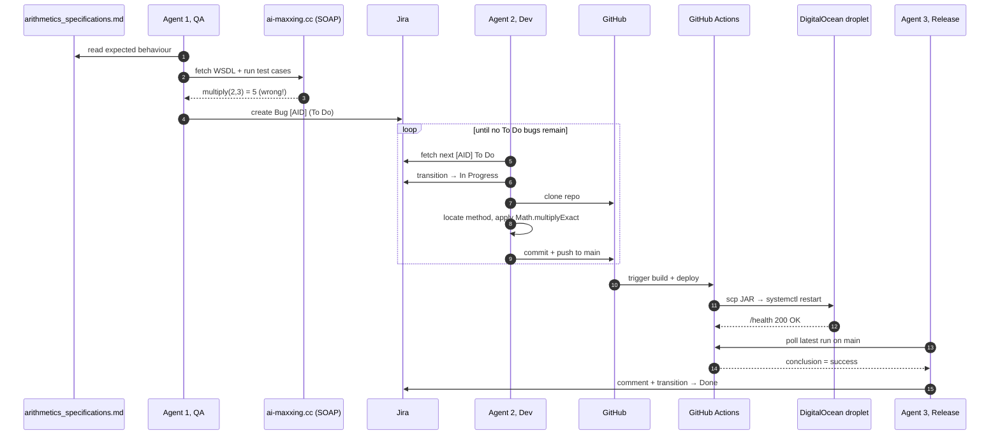
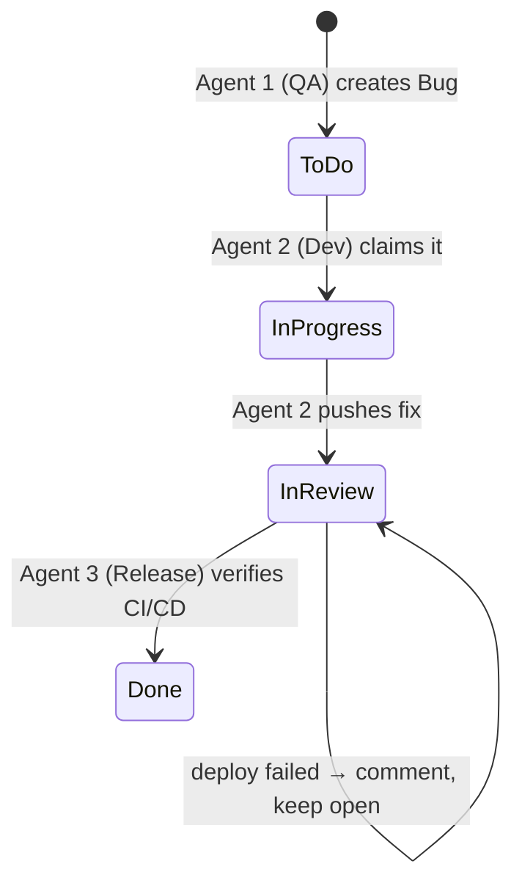
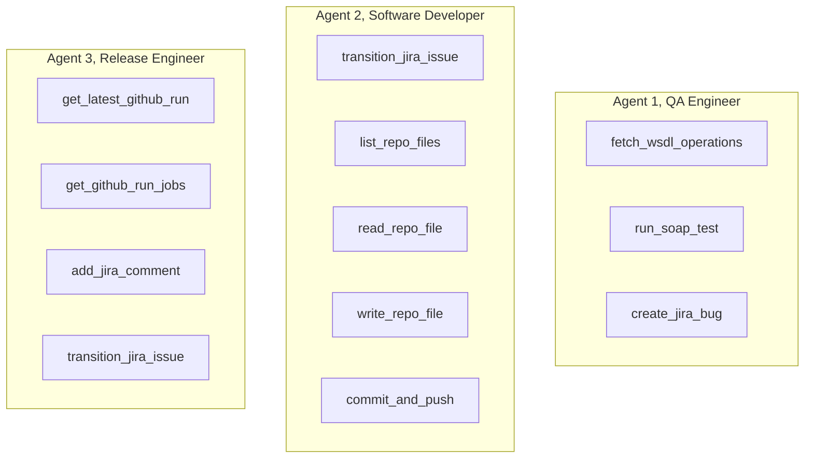
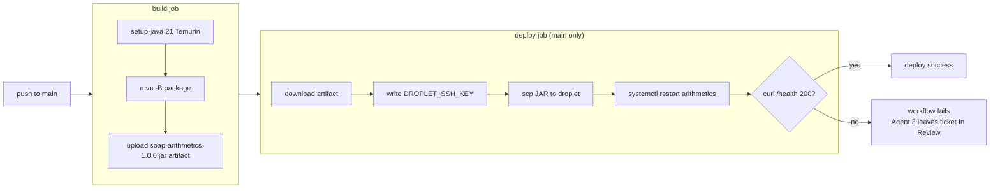

# Simple Agent Factory

> An **AI-driven, self-healing test-automation factory** for Java SOAP services.
> Three Claude agents detect bugs in production, fix the code, ship the patch, and close the ticket, without a human in the loop.

---

## demo recordings

* QA Tester agent: 
* Software Developer agent: 

## The pitch in one sentence

A faulty SOAP operation is detected against its written spec, a Jira bug is filed, a developer agent clones the repo, edits the Java source with `Math.*Exact` safe arithmetic, pushes to `main`, GitHub Actions deploys the fat JAR to a DigitalOcean droplet behind Nginx + Let's Encrypt, and a release agent verifies the deployment and closes the ticket, end to end, on its own.

---

## Runtime architecture



---

## The bug lifecycle, end to end



---

## Jira workflow, the agents' shared memory

The three agents never talk to each other directly. They coordinate via **Jira issue status**, which acts as a durable blackboard.



Every issue carries the `[AID]` prefix in its summary, a soft access control enforced in agent code so the shared `SSI` project stays uncontaminated by other use cases.

---

## Repositories in this org

| # | Repo | Role | Stack |
|---|------|------|-------|
| 0 | [`0_orchestration`](../../0_orchestration) | Sequencing the full pipeline (`qa → dev-loop → CI/CD poll → release`) | Python 3.11 |
| 1 | [`01_soap_arithmetics`](../../01_soap_arithmetics) | The target service under test, Java SOAP arithmetic with intentional bugs | Java 21, Jakarta XML WS 4.0, Maven, Ansible |
| 2 | [`02_agent1_qa`](../../02_agent1_qa) | QA Engineer, WSDL introspection + dynamic SOAP testing + Jira reporting | Python, Zeep, Anthropic SDK |
| 3 | [`03_agent2_dev`](../../03_agent2_dev) | Software Developer, clones repo, locates the bug, patches the Java, pushes | Python, GitPython, Anthropic SDK |
| 4 | [`04_agent3_release`](../../04_agent3_release) | Release Engineer, verifies the GitHub Actions run, closes the ticket | Python, GitHub REST API, Anthropic SDK |

---

## What each agent can do (tool surface)



Each agent runs a standard Claude tool-use loop (`claude-opus-4-6`), the LLM picks tools, the Python harness executes them, results are fed back until the model emits `end_turn`.

---

## The intentional defects (demo scenarios)

The deployed service ships with three planted bugs so the agents always have something to find:

| Operation | Bug | Symptom | Expected fix |
|---|---|---|---|
| `subtract(a, b)` | Computes `a - 2b` | `subtract(10, 3) → 4` | `Math.subtractExact(a, b)` |
| `multiply(a, b)` | Uses `Math.addExact` | `multiply(2, 3) → 5` | `Math.multiplyExact(a, b)` |
| `divide(a, b)` | No zero-check | `divide(1, 0) → raw exception` | guard `if (b == 0)` + SOAP Fault |

---

## CI/CD pipeline



---

## Infrastructure stack

| Layer | Technology | Notes |
|---|---|---|
| **Reasoning** | Claude Opus (Anthropic API) | Tool-use loop per agent, system prompt cached |
| **Ticketing** | Jira Cloud REST API v3 | Project `SSI`, all AID issues prefixed `[AID]` |
| **VCS** | GitHub + dedicated machine account | Push via SSH from Agent 2 |
| **CI** | GitHub Actions | `build` (every push/PR) + `deploy` (main only) |
| **Runtime** | OpenJDK 21 + Jakarta XML WS 4.0 | Fat JAR, `Math.*Exact` for overflow-safe arithmetic |
| **Hosting** | DigitalOcean droplet (Ubuntu) | systemd unit `arithmetics` on `:8081` |
| **Edge** | Nginx + Let's Encrypt (Certbot) | TLS on `:443`, auto-renewing via systemd timer |
| **Provisioning** | Ansible (`ansible/bootstrap.yml`) | Two-phase Nginx config to bootstrap the cert |
| **Domain** | `ai-maxxing.cc` | A record → droplet IP |

---

## Security posture (MVP-honest)

- **Ticket scoping**, every Jira create / read / update is gated on the `[AID]` prefix, enforced in agent code. Cross-contamination with non-AID tickets in the shared `SSI` project is rejected at the tool call.
- **Credential scoping**, each agent gets only what it needs: QA has Jira write + WSDL read, Dev has GitHub push via a dedicated machine account's SSH key, Release has read-only Jira + read-only GitHub Actions PAT.
- **Audit trail**, every action is recorded in Jira (issue history + comments) and GitHub (commit log + Actions runs). Nothing is lost.
- **MVP caveats**, no human-in-the-loop, no automatic loopback if a fix regresses, single-pass logic. Documented intentionally.

---

## Running the full pipeline

```bash
# one shot, all four stages
python 0_orchestration/orchestrator.py

# or just one stage, for debugging
python 0_orchestration/orchestrator.py --agent qa
python 0_orchestration/orchestrator.py --agent dev
python 0_orchestration/orchestrator.py --agent release
```

Each agent reads its own `.env` (see `<agent>/.env.example`) and requires `ANTHROPIC_API_KEY`. The orchestrator chains them and polls GitHub Actions between Stage 2 and Stage 4.

---

## Why this matters

Classical test automation is brittle: a renamed field, a tweaked operator, a missing exception type, and the whole script breaks. This factory replaces that brittleness with **agentic flexibility**: each agent reads natural-language specs, introspects live contracts, reasons over real code, and uses the same enterprise tools (Jira, Git, CI) a human team would. The result is a closed remediation loop where the only artifact a human ever needs to read is the final, auto-closed Jira ticket.
